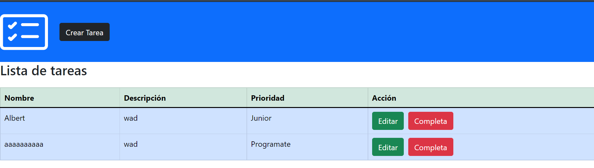
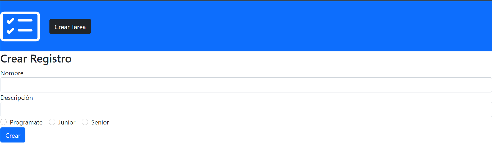
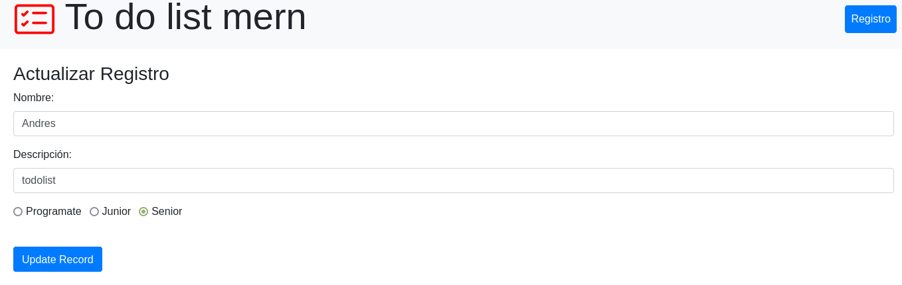
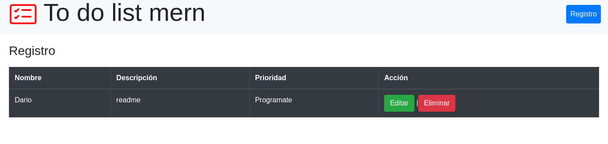

# ToDo List

---


---



---



---



---

## Instalación

Crear Atlas URI con estos parametros `server/config.env` Atlas URI:
```
ATLAS_URI=mongodb+srv://<username>:<password>@sandbox.jadwj.mongodb.net/myFirstDatabase?retryWrites=true&w=majority
PORT=5000
```
Instalar dependencias:
```
cd server
npm install
npm start
```

Instalar dependencias del Web server
```
cd client
npm install
npm start
```

#### Tecnologías:

- react
- node
- ATLAS MONGODB
- EXPRESS

---
```
```
---

#### Deploy:

## [todolist MERN (FRONTEND) HEROKU](https://app-client-2.herokuapp.com/edit/624b496314f85b043d3553b3)
___
## [GIT MERN (FRONTED/BACKEND) GITHUB](https://github.com/Jhuset2003/To_Do_List)

___
```
``` 
---
#### Recursos:
      mongodb university.


[](https://github.com/dariohimo)

---
____
```
```
## [Albert Quintanilla](https://github.com/Jhuset2003)
---
&copy; Abril 05 de 2022

---

